# 🪪 OS2Adgang
*Identity management based on open standards*
---

## Status update 05 jan 2026:

- v.0.8 using Authentik is runnig without federation on an beta/poc instance @ Digitalist Cloud.
- 0.9 will probably see a shift towards the CNCF certified KeyCloak project, with a possible option of keeping Authentik as a "lite" "non-federated" solution .. but this is not decided yet.
  We need a maintainer/core team model for this approach

The upstream project [Authentik](https://github.com/goauthentik/authentik/) has been chosen as the core upstream component for the v.0.8 of this solution.

## 🔀 Dataflow

```mermaid

graph TD

subgraph OS2
    OS2ID[["⚙️ OSID"]]-.-|"🆔"|Users["🛢 User cache"]
    OS2ID[["⚙️ OSID"]]-.-|"🏷️"|Roles["🏷️ Roles"]
    Applikation1([OS2-Kommunikation])
    Applikation2([OS2-Fildeling])
end

subgraph KK[Korsbæk Kommune]
UserStore[("Users")]
User
end

subgraph KOMBIT
fkadg[[" ⚙️Fælleskommunal Adgangsstyring"]]
end

KOMBIT-->|"🆔+🏷️ SAML"|OS2ID

User("user👩🏻‍💻")-->|"🆔 Single Sign On"|OS2ID-->|" 🎟️ Token"|Applikation2 & Applikation1
UserStore-.-|"🆔+🏷️"|fkadg

```

## 📚 Documentation

#### 🗂️ Project description:
  [🇬🇧 in english](/docs/project_description.md#-os2id---identity-and-accessmanagent)
  
  [🇩🇰 in danish](/docs/project_description.md#-os2id---identitets--og-adgangsstyring)
  
  [🧩 High level architecture](/docs/High_Level_Architecture.md)
 
---
🎁 [How to contribute](CONTRIBUTING.md)

⚖️ [CODE OF CONDUCT (in danish for now)](https://github.com/OS2offdig/about/blob/main/CODE_OF_CONDUCT.md)
