# 🪪 OS2Adgang
*Identity management based on open standards*
---

## Status update 05 jan 2026:

- v.0.8 using Authentik is running without federation on an beta/poc instance @ Digitalist Cloud.
- 0.9 will see a shift towards the [CNCF certified KeyCloak project](https://www.cncf.io/projects/keycloak/), with a possible option of keeping Authentik as a "lite" "non-federated" solution .. but this is not decided yet.
  We need a maintainer/core team model for this approach - currently this work is sponsored by the os2ai community and work being done by @hypesystem / Deranged. Follow the progress in this issue: https://github.com/OS2sandbox/os2adgang-planning/issues/89

Currently a deployment-blueprint is being buit here: https://github.com/OS2sandbox/os2adgang-blueprint/

## 🔀 Dataflow

```mermaid

graph TD

subgraph Hosting Provider
    OS2ID[["⚙️ os2adgang"]]-.-|"🆔"|Users["🛢 User cache"]
    Applikation1([OS2-Applikation1])
    Applikation2([OS2-Applikation2])
end

subgraph KK[Korsbæk Kommune]
UserStore[("Users")]
User
end

subgraph KOMBIT
fkadg[[" ⚙️Fælleskommunal Adgangsstyring"]]
end

KOMBIT-->|"🆔+🏷️ SAML"|OS2ID

User("user👩🏻‍💻")-->|"🆔 Single Sign On"|OS2ID-->|" 🎟️ Token"|Applikation2 & Applikation1
UserStore-.-|"🆔+🏷️"|fkadg

```

---

🗺️ [Reference architecture proposal](https://github.com/OS2sandbox/os2adgang-planning/blob/main/docs/FKA-C4-example.md)
> C4 diagram illustrating os2adgang integrating with [the danish municipal SAML Idp](https://digitaliseringskataloget.dk/integration/sf1511) and [organization SOAP/XML metadataprovider](https://digitaliseringskataloget.dk/integration/sf1500)
---
🎁 [How to contribute](CONTRIBUTING.md)

⚖️ [CODE OF CONDUCT (in danish for now)](https://github.com/OS2offdig/about/blob/main/CODE_OF_CONDUCT.md)
