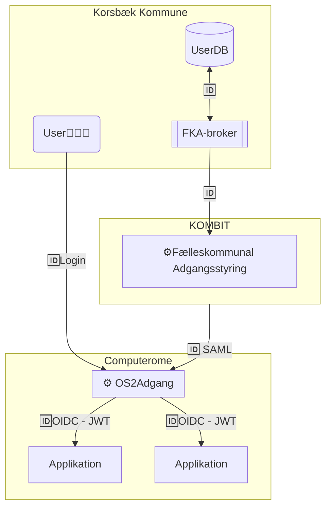

## Dataflow and component archihtecture

```mermaid
flowchart TB
 subgraph OS2Adgang["⚙️ OS2Adgang"]
  end
 subgraph KK["Korsbæk Kommune"]
    direction TB
        user("User👩🏻‍💻")
        Sync[["FKA-broker"]]
        UserStore[("UserDB")]
  end
 subgraph KOMBIT["KOMBIT"]
        fkadg["⚙️Fælleskommunal Adgangsstyring"]
  end
 subgraph Computerome["Computerome"]
        Applikation1["Applikation"]
        Applikation2["Applikation"]
        OS2Adgang
  end
    UserStore <-- 🆔 --> Sync
    KOMBIT -- 🆔 SAML --> OS2Adgang
    OS2Adgang -- "🆔OIDC - JWT" --> Applikation1 & Applikation2
    user -- 🆔Login --> OS2Adgang
    Sync --🆔 --> fkadg
```
