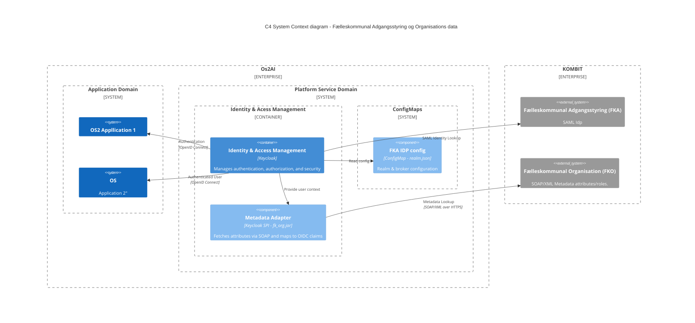

# Reference architecture proposal
> Example diagram using the [C4 Model](https://c4model.com/) of how version 0.9 could be designed to integrate with [the danish municipal SAML Idp](https://digitaliseringskataloget.dk/integration/sf1511) and [organization SOAP/XML metadataprovider](https://digitaliseringskataloget.dk/integration/sf1500)

